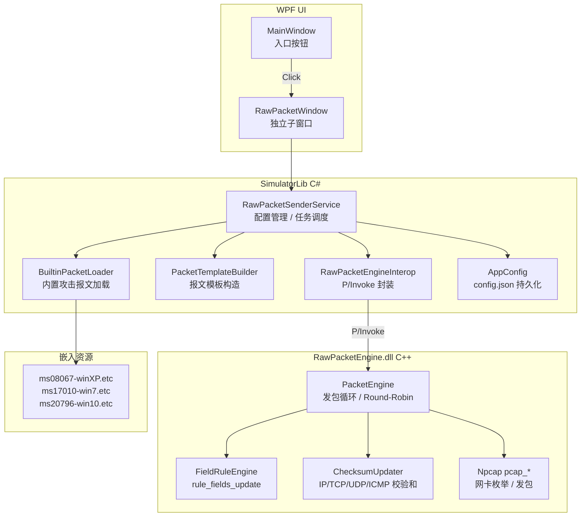

# 设计文档：原始报文发送模块（raw-packet-sender）

## Overview

本模块为 IEGPerTest Simulator 新增"原始报文发送"功能，移植 xb-ether-tester（xiaobing）工具的核心发包能力。

核心思路：新增一个 C++ DLL（`RawPacketEngine.dll`），封装 Npcap pcap 发包循环、字段变化规则（FieldRule）和校验和更新逻辑；C# 层（`SimulatorLib`）通过 P/Invoke 调用 DLL，负责配置管理、报文模板构造、内置攻击报文加载和 UI 交互；独立 WPF 子窗口（`RawPacketWindow`）承载全部 UI，主界面仅保留一个入口按钮。

架构与现有 `NativeEngine.dll` / `NativeSender.dll` 完全对齐：C++ DLL 导出 `extern "C"` 函数，C# 通过 `[DllImport]` 调用，配置通过 `config.json` 的新节点持久化。

**单文件打包约束：** `RawPacketEngine.dll` 必须与 `NativeEngine.dll` / `NativeSender.dll` 采用相同方式内嵌进单文件 EXE——在 `SimulatorApp.csproj` 中以 `<None>` + `ExcludeFromSingleFile=false` + `IncludeNativeLibrariesForSelfExtract=true` 声明，`publish_simulatorapp.ps1` 脚本同步增加 `RawPacketEngine.dll` 的构建步骤。发布产物仍然只有一个 `SimulatorApp.exe`。

---

## Architecture



**关键设计决策：**

1. **DLL 内部线程**：发包循环在 DLL 内部的 OS 线程运行，与 NativeEngine.dll 的心跳线程模式一致，C# UI 线程不阻塞。
2. **Stream 数据所有权**：C# 调用 `RPE_AddStream` 时将字节数组复制进 DLL，DLL 持有副本；C# 侧保留原始 `StreamConfig` 用于 UI 显示和持久化。
3. **内置报文嵌入资源**：三个 `.etc` 文件作为 `EmbeddedResource` 打包进 `SimulatorLib.dll`，运行时通过 `Assembly.GetManifestResourceStream` 加载，无需外部文件。
4. **校验和更新时机**：字段编辑（目的IP/MAC 替换、FieldRule 应用）后立即在 C# 侧更新校验和，再传入 DLL；DLL 内 FieldRule 触发的校验和更新在发包线程内完成（对齐 xb-ether-tester `update_check_sum`）。

---

## Components and Interfaces

### 1. RawPacketEngine.dll（C++）

导出接口（`extern "C" __declspec(dllexport)`）：

```c
// 初始化 Npcap，枚举适配器。返回 0 成功 / -1 失败。
int32_t RPE_Init();

// 释放所有资源，停止发包线程。
void RPE_Cleanup();

// 返回枚举到的适配器数量。
int32_t RPE_GetAdapterCount();

// 获取指定适配器的 pcap 名称和 IPv4 地址字符串。
// 返回 0 成功 / -1 越界。
int32_t RPE_GetAdapterInfo(int32_t index,
    char* name, int32_t nameLen,
    char* ipv4, int32_t ipv4Len);

// 选择发包适配器。返回 0 成功 / -1 失败。
int32_t RPE_SelectAdapter(int32_t index);

// 添加一条 Stream（复制 data 字节数组）。
// 返回 stream_id（>=0）或 -1 失败。
int32_t RPE_AddStream(const uint8_t* data, int32_t len,
    const char* name,
    const RPE_Rule* rules, int32_t ruleCount,
    uint32_t checksumFlags);

// 清空所有 Stream。
void RPE_ClearStreams();

// 启用/禁用某条 Stream（运行中立即生效）。
void RPE_SetStreamEnabled(int32_t streamId, int32_t enabled);

// 设置速率配置。
// speedType: 0=PPS, 1=Interval(us), 2=Fastest
// sndMode:   0=Continuous, 1=Burst
void RPE_SetRateConfig(int32_t speedType, int64_t speedValue,
    int32_t sndMode, int64_t sndCount);

// 启动发包循环（DLL 内部线程）。返回 0 成功 / -1 失败。
int32_t RPE_Start();

// 停止发包循环，阻塞等待线程退出（最多 1000ms）。
void RPE_Stop();

// 获取当前统计数据（线程安全）。
void RPE_GetStats(uint64_t* sendTotal, uint64_t* sendBytes,
    uint64_t* sendFail);
```

`RPE_Rule` 结构（对齐 xb-ether-tester `t_rule`）：

```c
typedef struct {
    uint8_t  valid;
    uint32_t flags;       // 字段类型标志
    uint16_t offset;      // 字段在报文中的字节偏移
    uint8_t  width;       // 字段宽度（字节）
    int8_t   bits_from;   // 位域起始（-1 表示整字节）
    int8_t   bits_len;    // 位域长度
    uint8_t  base_value[8];
    uint8_t  max_value[8];
    uint32_t step_size;
} RPE_Rule;
```

### 2. RawPacketEngineInterop（C#，SimulatorLib）

P/Invoke 封装，模式与 `NativeEngineInterop` 完全一致：

```csharp
public sealed class RawPacketEngineInterop : IDisposable
{
    private const string DLL = "RawPacketEngine.dll";

    [DllImport(DLL, CallingConvention = CallingConvention.Cdecl)]
    private static extern int RPE_Init();

    [DllImport(DLL, CallingConvention = CallingConvention.Cdecl)]
    private static extern void RPE_Cleanup();

    // ... 其余 P/Invoke 声明 ...

    public bool Init() => RPE_Init() == 0;
    public void Cleanup() => RPE_Cleanup();
    public int GetAdapterCount() => RPE_GetAdapterCount();
    // ... 托管包装方法 ...
}
```

### 3. RawPacketSenderService（C#，SimulatorLib）

业务逻辑层，协调 Interop、配置和 UI 回调：

```csharp
public sealed class RawPacketSenderService
{
    public IReadOnlyList<NicAdapterInfo> Adapters { get; }
    public IReadOnlyList<StreamConfig> Streams { get; }
    public SendTaskStatus Status { get; }
    public SendStats Stats { get; }

    public bool Initialize();
    public void SelectAdapter(int index);
    public int AddStream(StreamConfig config);
    public void RemoveStream(int streamId);
    public void SetStreamEnabled(int streamId, bool enabled);
    public void SetRateConfig(RateConfig config);
    public bool Start();
    public void Stop();
    public void RefreshStats();  // 由 UI 定时器调用
}
```

### 4. PacketTemplateBuilder（C#，SimulatorLib）

纯 C# 实现，构造各协议以太网帧字节数组，并提供字段编辑和校验和更新：

```csharp
public static class PacketTemplateBuilder
{
    public static byte[] BuildIcmpEchoRequest(
        byte[] srcMac, byte[] dstMac,
        uint srcIp, uint dstIp);

    public static byte[] BuildTcpSyn(
        byte[] srcMac, byte[] dstMac,
        uint srcIp, uint dstIp,
        ushort srcPort, ushort dstPort);

    public static byte[] BuildUdp(
        byte[] srcMac, byte[] dstMac,
        uint srcIp, uint dstIp,
        ushort srcPort, ushort dstPort,
        byte[] payload);

    public static byte[] BuildArpRequest(
        byte[] srcMac, uint srcIp, uint targetIp);

    public static byte[] BuildIcmpv6EchoRequest(
        byte[] srcMac, byte[] dstMac,
        byte[] srcIp6, byte[] dstIp6);

    // 字段编辑：修改目的IP并重算校验和
    public static void SetDestinationIp(byte[] frame, uint dstIp);
    public static void SetDestinationMac(byte[] frame, byte[] dstMac);
    public static void RecalculateChecksums(byte[] frame, uint checksumFlags);
}
```

### 5. BuiltinPacketLoader（C#，SimulatorLib）

从嵌入资源加载 `.etc` 文件，解析为 `StreamConfig` 列表：

```csharp
public static class BuiltinPacketLoader
{
    public static readonly BuiltinPacketDef[] Definitions = {
        new("MS08-067", "Windows XP", "ms08067-winXP.etc"),
        new("MS17-010", "Windows 7",  "ms17010-win7.etc"),
        new("MS20-796", "Windows 10", "ms20796-win10.etc"),
    };

    // 从嵌入资源加载并解析 .etc 文件，返回 Stream 列表
    public static List<StreamConfig> Load(string resourceName);
}
```

### 6. EtcFileParser（C#，SimulatorLib）

解析 xb-ether-tester `.etc` 二进制格式：

```csharp
public static class EtcFileParser
{
    // 解析 .etc 文件，返回 (RateConfig, List<StreamConfig>)
    public static (RateConfig rate, List<StreamConfig> streams)
        Parse(Stream input);

    // 将 Stream 列表序列化为 .etc 格式
    public static void Write(Stream output,
        RateConfig rate, IEnumerable<StreamConfig> streams);
}
```

`.etc` 文件格式（对齐 xb-ether-tester `save_stream` / `load_stream`）：

| 偏移 | 大小 | 内容 |
|------|------|------|
| 0 | 4 | 版本头（`version[4]`） |
| 4 | sizeof(t_fc_cfg) | 速率配置 |
| 4+fc | PKT_CAP_CFG_FIX_LEN + filter_str_len | 抓包配置 |
| ... | 4 | Stream 数量 |
| ... | STREAM_HDR_LEN + len | 各 Stream 数据 |

### 7. RawPacketWindow（WPF，SimulatorApp）

独立子窗口，MVVM 模式，`RawPacketViewModel` 绑定 `RawPacketSenderService`。

---

## Data Models

### StreamConfig（C# 持久化模型）

```csharp
public class StreamConfig
{
    public int Id { get; set; }
    public string Name { get; set; } = "";
    public PacketType Type { get; set; }
    public bool Enabled { get; set; } = true;

    // 报文字节数组（Base64 序列化到 config.json）
    public byte[] FrameData { get; set; } = Array.Empty<byte>();

    // 字段变化规则（最多 10 条）
    public List<FieldRuleConfig> Rules { get; set; } = new();

    // 校验和自动更新标志（对齐 t_stream.flags）
    public uint ChecksumFlags { get; set; }

    // 显示用摘要字段（从 FrameData 解析，不持久化）
    [JsonIgnore] public string SrcIp { get; set; } = "";
    [JsonIgnore] public string DstIp { get; set; } = "";
    [JsonIgnore] public string DstMac { get; set; } = "";
}

public enum PacketType
{
    IcmpEcho, TcpSyn, Udp, Arp, IcmpV6Echo,
    BuiltinMs08067, BuiltinMs17010, BuiltinMs20796,
    Custom
}
```

### FieldRuleConfig（对齐 xb-ether-tester `t_rule`）

```csharp
public class FieldRuleConfig
{
    public bool Valid { get; set; }
    public uint Flags { get; set; }
    public ushort Offset { get; set; }    // 字段在报文中的字节偏移
    public byte Width { get; set; }       // 字段宽度（字节，1/2/4）
    public sbyte BitsFrom { get; set; }   // -1 = 整字节
    public sbyte BitsLen { get; set; }
    public byte[] BaseValue { get; set; } = new byte[8];
    public byte[] MaxValue { get; set; } = new byte[8];
    public uint StepSize { get; set; }
}
```

### RateConfig

```csharp
public class RateConfig
{
    public SpeedType SpeedType { get; set; } = SpeedType.Pps;
    public long SpeedValue { get; set; } = 1000;  // PPS 或 间隔(us)
    public SendMode SendMode { get; set; } = SendMode.Continuous;
    public long BurstCount { get; set; } = 0;
}

public enum SpeedType { Pps, Interval, Fastest }
public enum SendMode  { Continuous, Burst }
```

### RawPacketSenderConfig（config.json 节点）

```csharp
public class RawPacketSenderConfig
{
    public string LastAdapterName { get; set; } = "";
    public RateConfig Rate { get; set; } = new();
    public List<StreamConfig> Streams { get; set; } = new();
}
```

`config.json` 示例：

```json
{
  "RawPacketSender": {
    "LastAdapterName": "\\Device\\NPF_{GUID}",
    "Rate": {
      "SpeedType": "Pps",
      "SpeedValue": 1000,
      "SendMode": "Continuous",
      "BurstCount": 0
    },
    "Streams": [
      {
        "Id": 0,
        "Name": "MS17-010",
        "Type": "BuiltinMs17010",
        "Enabled": true,
        "FrameData": "<base64>",
        "Rules": [],
        "ChecksumFlags": 31
      }
    ]
  }
}
```

### SendStats（运行时统计，不持久化）

```csharp
public class SendStats
{
    public ulong SendTotal { get; set; }
    public ulong SendBytes { get; set; }
    public ulong SendFail { get; set; }
    public double CurrentPps { get; set; }  // 由 C# 定时器计算
}
```

### NicAdapterInfo

```csharp
public class NicAdapterInfo
{
    public int Index { get; set; }
    public string PcapName { get; set; } = "";
    public string FriendlyName { get; set; } = "";
    public string Ipv4 { get; set; } = "";
    public string DisplayText => $"{Ipv4,-15} {FriendlyName}";
}
```

---

## UI 布局（RawPacketWindow）

```
┌─────────────────────────────────────────────────────────────────────┐
│ [顶部] 网卡选择下拉框 ▼  Npcap状态: ● 正常                           │
├──────────────┬──────────────────────────────┬───────────────────────┤
│ [左侧]       │ [中部]                        │ [右侧]                │
│ 内置攻击报文  │ Stream 列表 (DataGrid)        │ 速率配置              │
│ ☑ MS08-067  │ # | 名称 | 类型 | 源IP | 目的IP│ 模式: ○PPS ○间隔 ○最快│
│ ☑ MS17-010  │   | 目的MAC | ☑启用           │ 值: [1000] pps        │
│ ☐ MS20-796  │                               │ 发包模式:             │
│             │ [导入] [编辑] [删除]           │ ○持续 ○定量[___]次    │
│ 目的IP:      │                               │                       │
│ [_________] │                               │ [开始发送] [停止]     │
│ 目的MAC:     │                               │                       │
│ [_________] │                               │                       │
├─────────────┴──────────────────────────────┴───────────────────────┤
│ [底部] 已发包: 0  已发字节: 0 B  失败: 0  当前PPS: 0               │
└─────────────────────────────────────────────────────────────────────┘
```

---

## Correctness Properties


*A property is a characteristic or behavior that should hold true across all valid executions of a system — essentially, a formal statement about what the system should do. Properties serve as the bridge between human-readable specifications and machine-verifiable correctness guarantees.*

### Property 1: 构造帧校验和正确性

*For any* 有效的源/目的 IP 地址、源/目的 MAC 地址和协议类型（ICMP/TCP SYN/UDP/ARP/ICMPv6），`PacketTemplateBuilder` 构造的以太网帧字节数组，以及任何字段编辑（目的IP替换、目的MAC替换、FieldRule 应用）后的帧，其 IP 校验和、TCP/UDP/ICMP 校验和均应通过独立校验和验证函数的验证。

**Validates: Requirements 2.2, 2b.3, 2c.6, 3.3**

### Property 2: IP 范围展开完整性

*For any* 有效的起始 IP（`startIp`）和结束 IP（`endIp`），其中 `startIp <= endIp`，`RawPacketSenderService.ExpandIpRange(startIp, endIp)` 返回的 Stream 列表长度应等于 `endIp - startIp + 1`，且列表中第 i 条 Stream 的源 IP 字段应等于 `startIp + i`，所有源 IP 值互不相同。

**Validates: Requirements 2.3**

### Property 3: 输入验证拒绝无效输入

*For any* 不符合 IPv4 点分十进制格式的字符串（包括空字符串、纯空白、超出范围的数字、字母混合等），`InputValidator.IsValidIpv4` 应返回 false；*For any* 不符合 `XX:XX:XX:XX:XX:XX` 或 `XX-XX-XX-XX-XX-XX` 格式的字符串，`InputValidator.IsValidMac` 应返回 false；*For any* 超出 `[1, 1_000_000]` 范围的整数，`InputValidator.IsValidPps` 应返回 false。

**Validates: Requirements 2.4, 2.5, 2.6, 4.3**

### Property 4: .etc 文件格式往返

*For any* 有效的 `RateConfig` 和 `StreamConfig` 列表（Stream 数量在 `[0, 100]` 范围内，每条 Stream 的 `FrameData` 非空），将其通过 `EtcFileParser.Write` 序列化为字节流后，再通过 `EtcFileParser.Parse` 反序列化，应得到与原始输入等价的 `RateConfig` 和 `StreamConfig` 列表（字段值逐一相等）。

**Validates: Requirements 2c.3, 2c.8**

### Property 5: 配置 JSON 往返

*For any* 有效的 `RawPacketSenderConfig` 对象（包含任意合法的适配器名称、速率配置和 Stream 列表），通过 `System.Text.Json` 序列化为 JSON 字符串后再反序列化，应得到与原始对象等价的配置对象（所有字段值相等，`FrameData` 字节数组内容相同）。

**Validates: Requirements 8.4, 1.4**

### Property 6: FieldRule 字段值循环递增

*For any* 有效的 `FieldRuleConfig`（`baseValue <= maxValue`，`stepSize >= 1`，`width` 为 1/2/4 字节），对一个报文帧连续应用该规则 N 次后，字段值应等于 `baseValue + (N * stepSize) mod (maxValue - baseValue + 1)`（模运算回绕到 `baseValue`）。

**Validates: Requirements 3.2**

### Property 7: 发送统计单调递增

*For any* 正在运行的 `SendTask`，在任意两个时间点 `t1 < t2` 采集的统计数据中，`sendTotal(t2) >= sendTotal(t1)` 且 `sendBytes(t2) >= sendBytes(t1)` 且 `sendFail(t2) >= sendFail(t1)` 均成立（统计计数器只增不减）。

**Validates: Requirements 6.3, 6.4**

### Property 8: Round-Robin 发送覆盖所有启用 Stream

*For any* 包含 N 条（N >= 1）已启用 Stream 的 `SendTask`，在发送至少 N 次后，每条已启用的 Stream 至少被发送一次（Round-Robin 保证公平覆盖）。

**Validates: Requirements 5.2**

---

## Error Handling

| 错误场景 | 检测方式 | 处理策略 | 用户反馈 |
|---------|---------|---------|---------|
| Npcap 未安装 / `RPE_Init` 返回 -1 | 初始化时检查返回值 | 禁用发包功能，显示错误 | "Npcap 未安装或初始化失败，请安装 Npcap" |
| `pcap_open_live` 失败 | `RPE_Start` 返回 -1 | 任务状态设为"错误" | "无法打开适配器 {name}，请检查 Npcap 权限" |
| 连续 100 次 `pcap_sendpacket` 失败 | DLL 内部计数器 | 自动停止任务，通过 `RPE_GetStats` 的 `sendFail` 反映 | "连续发包失败，任务已终止" |
| 未选择适配器就调用 `RPE_Start` | DLL 内部状态检查 | 返回 -1，不启动线程 | "请先选择网络适配器" |
| `.etc` / `.pcap` 文件解析失败 | `EtcFileParser.Parse` 抛出异常 | 捕获异常，已有 Stream 列表不变 | "文件 {name} 解析失败：{reason}" |
| IP/MAC 格式无效 | `InputValidator` 验证 | 阻止任务启动，输入框显示红色边框 | 对应字段下方显示验证提示 |
| `RawPacketWindow` 关闭时任务运行中 | `Window.Closing` 事件 | 调用 `RPE_Stop()` 后关闭 | 无（静默停止） |

**连续失败计数器实现（DLL 内部）：**

```c
// 发包循环内
if (pcap_sendpacket(...) != 0) {
    stats.send_fail++;
    consecutive_fail++;
    if (consecutive_fail >= 100) {
        // 设置错误标志，退出循环
        error_state = ERR_CONSECUTIVE_FAIL;
        break;
    }
} else {
    consecutive_fail = 0;  // 成功后重置
}
```

---

## Testing Strategy

### 双轨测试方法

本模块采用单元测试 + 属性测试的双轨策略：

- **单元测试**：验证具体例子、边界条件和错误处理路径
- **属性测试**：验证上述 8 个 Correctness Properties，覆盖随机输入

### 属性测试配置

- **测试库**：[FsCheck](https://fscheck.github.io/FsCheck/)（.NET 属性测试库，支持 C# 和 F#）
- **每个属性最少运行 100 次**（FsCheck 默认 100 次，可通过 `[Property(MaxTest = 500)]` 调整）
- **标签格式**：`// Feature: raw-packet-sender, Property {N}: {property_text}`

### 属性测试实现示例

```csharp
// Feature: raw-packet-sender, Property 1: 构造帧校验和正确性
[Property(MaxTest = 200)]
public Property BuildIcmpFrame_ChecksumAlwaysValid(
    byte[] srcMac6, byte[] dstMac6, uint srcIp, uint dstIp)
{
    // Arrange: 过滤无效输入
    if (srcMac6.Length != 6 || dstMac6.Length != 6) return true.ToProperty();

    // Act
    var frame = PacketTemplateBuilder.BuildIcmpEchoRequest(srcMac6, dstMac6, srcIp, dstIp);

    // Assert: 独立校验和验证
    return ChecksumVerifier.IsIpChecksumValid(frame).ToProperty();
}

// Feature: raw-packet-sender, Property 4: .etc 文件格式往返
[Property(MaxTest = 100)]
public Property EtcFile_RoundTrip(RateConfig rate, StreamConfig[] streams)
{
    using var ms = new MemoryStream();
    EtcFileParser.Write(ms, rate, streams);
    ms.Position = 0;
    var (rate2, streams2) = EtcFileParser.Parse(ms);
    return (rate.Equals(rate2) && streams.SequenceEqual(streams2)).ToProperty();
}

// Feature: raw-packet-sender, Property 5: 配置 JSON 往返
[Property(MaxTest = 100)]
public Property Config_JsonRoundTrip(RawPacketSenderConfig config)
{
    var json = JsonSerializer.Serialize(config);
    var config2 = JsonSerializer.Deserialize<RawPacketSenderConfig>(json);
    return config.Equals(config2).ToProperty();
}
```

### 单元测试覆盖点

| 测试类 | 覆盖内容 |
|--------|---------|
| `PacketTemplateBuilderTests` | 每种协议类型构造一个具体例子，验证以太网头/IP头字段值 |
| `BuiltinPacketLoaderTests` | 三种内置报文资源加载成功，字节数组非空 |
| `InputValidatorTests` | 合法/非法 IP、MAC、PPS 的边界值例子 |
| `EtcFileParserTests` | 空 Stream 列表、单条 Stream、含 FieldRule 的 Stream |
| `RawPacketSenderServiceTests` | Npcap 初始化失败时服务状态、连续失败自动停止 |
| `RawPacketEngineInteropTests` | P/Invoke 调用不崩溃（集成测试，需 Npcap 环境） |

### 构建集成

- 属性测试和单元测试统一放在 `src/SimulatorLib.Tests/` 项目
- CI 运行：`dotnet test --run`（单次执行，不使用 watch 模式）
- DLL 集成测试需要 Npcap 环境，标记 `[Trait("Category", "Integration")]` 可选跳过
